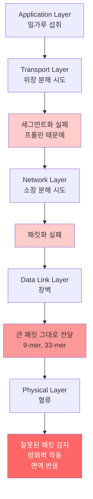

## 글루텐
글루텐은 두 가지 주요 단백질 그룹으로 구성되어 있다.

- **글루테닌(Glutenin)**
- **글리아딘(Gliadin)**
	- 밀가루 무게의 약 50% 정도를 차지한다.
	- 반죽에 점성과 유동성을 부여한다.
	- 물에 녹지 않는 둥근 단백질, 알코올에 용해되는 프롤라민 아미노산 계열 단백질

## 글루텐이 우리 몸에 미치는 영향
글루텐을 섭취 시 발생하는 악영향은 아래와 같다.
- 소화 불량
- 장누수
- 피부 트러블
- 기분 조절 장애

기본적으로 우리 몸에 악영향을 미치는 것은 글리아딘이 대부분을 차지한다. 글루텐의 주요 구성 성분인 글리아딘 단백질이 장에서 소화 작용을 거치며 펩타이드로 분해가 되는데 이 펩타이드들이 소화 과정을 거치면서 대부분의 문제를 야기한다.

 ![[Drawing 2025-12-31 13.26.27.excalidraw]]
1. 소화불량
	글루텐의 글리아딘 단백질이 완전히 분해되지 않는다. 글리아딘을 구성하는 프롤린 아미노산이 매우 촘촘한 배열을 가지고 있는 게 문제다. 이 배열이 소화 효소가 잘 자르지 못하는 구조로 이루어져 있기 때문에, 분해되지 않은 펩타이드 조각들이 장에 남아 소화불량을 일으킨다(33-mer). 또한 이러한 불완전한 소화는 복부 팽만, 가스, 복통 등을 유발한다.

2. 장누수
	9-mer 펩타이드는 CXCR3 수용체에 붙으면 장세포는 **조눌린**이라는 펩타이드 호르몬을 분비하는데, 이 조눌린이 장의 치밀 결합을 풀어버리고 고분자들이 이동할 있는 통로가 생긴다. 즉, 장누수를 일으킨다. 

3. 피부 트러블
	분해되지 않은 33-mer 펩타이드 조각이 장누수로 인해 장 점막을 통과하면서 면역 반응을 유발한다. 대표적으로 셀리악병과 포진성 피부염(손발가락 수포증)이 있다.

4. 기분 조절 장애 
	장누수로 인해 혈류로 유입된 글리아딘 펩타이드 조각들이 뇌혈관장벽을 통과하여 신경전달물질에 영향을 주거나, 장내 세로토닌 생성을 방해하여 우울감, 불안, 집중력 저하 등을 유발할 수 있다. 이를 '장-뇌 축(Gut-Brain Axis)' 문제라고 한다.

최종적으로는 아미노산으로 전부 분해가 되어야 할 것들이 분해가 되지 않기 때문에 우리 몸에서 면역 반응을 일키게 된다.
개발자적으로 이해하면은 더 잘게 쪼개져서 전송되어야 할 데이터들이 더 쪼개지지 않은 상태로 전달되기 때문에 우리 몸이라는 시스템에서 에러를 발생 시킨다. 이 에러 현상이 면역 반응이다.

### 참고
https://youtu.be/kekldmY-15s?si=cSJZ5rLMASq33wef