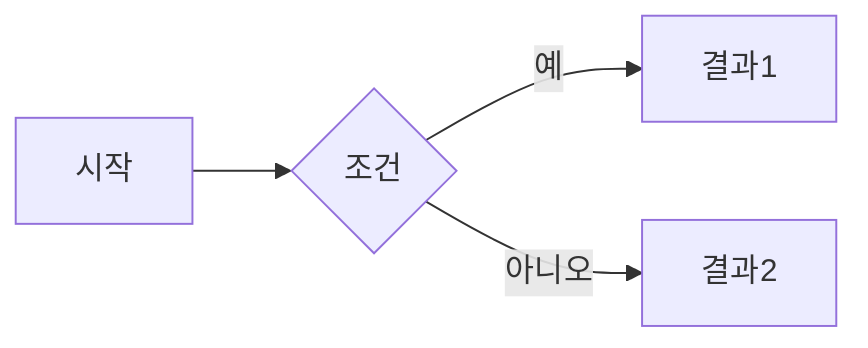
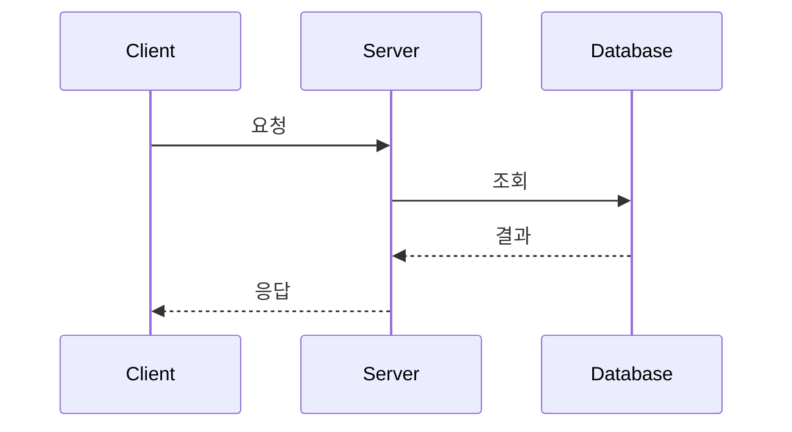

Obsidian에서 사용하는 마크다운 문법을 정리해보자.

## 기본 텍스트 서식

### 강조와 기울임
```markdown
**굵게** 또는 __굵게__
*기울임* 또는 _기울임_
***굵은 기울임***
~~취소선~~
==형광펜==
```

**굵게** 또는 __굵게__
*기울임* 또는 _기울임_
***굵은 기울임***
~~취소선~~
==형광펜==


### 제목
```markdown
# 제목 1
## 제목 2
### 제목 3
#### 제목 4
##### 제목 5
###### 제목 6
```

제목은 6단계까지 사용 가능하다. Obsidian에서는 `#` 개수가 많을수록 작은 글씨로 표시된다.


## 링크와 임베딩

### 내부 링크 (위키 스타일)
```markdown
[[다른 노트]]
[[다른 노트|표시할 텍스트]]
[[노트#제목]]
[[노트#제목|별칭]]
```

Obsidian의 핵심 기능이다. 이중 대괄호 `[[]]`로 다른 노트를 연결한다.

예시:
- `[[Spring Boot]]` → "Spring Boot" 노트로 링크
- `[[Spring Boot|스프링]]` → "스프링"이라고 표시되지만 Spring Boot 노트로 이동
- `[[개념 정리#DI]]` → "개념 정리" 노트의 "DI" 섹션으로 바로 이동


### 외부 링크
```markdown
[링크 텍스트](https://example.com)
<https://example.com>
```


### 이미지 삽입
```markdown
![[이미지.png]]
![[이미지.png|300]]
![[이미지.png|300x200]]

```

- `![[]]`는 Obsidian vault 내 이미지
- `|숫자`로 크기 조정 가능
- ``는 일반 마크다운 방식


### PDF 임베딩
```markdown
![[문서.pdf]]
![[문서.pdf#page=3]]
```

PDF 특정 페이지를 바로 임베딩할 수 있다.


## 리스트

### 순서 없는 리스트
```markdown
- 항목 1
- 항목 2
  - 하위 항목 2.1
  - 하위 항목 2.2
- 항목 3

* 별표로도 가능
+ 플러스로도 가능
```

들여쓰기(Tab 또는 스페이스 2개)로 계층 구조를 만든다.


### 순서 있는 리스트
```markdown
1. 첫 번째
2. 두 번째
   1. 하위 항목
   2. 하위 항목
3. 세 번째
```


### 체크리스트
```markdown
- [ ] 할 일 1
- [x] 완료된 일
- [ ] 할 일 2
  - [ ] 하위 할 일
```

- [x] 할 일 1 ✅ 2026-01-21
- [x] 완료된 일
- [x] 할 일 2 ✅ 2026-01-21
  - [x] 하위 할 일 ✅ 2026-01-21

Obsidian에서 클릭하면 체크/해제가 토글된다.


## 코드

### 인라인 코드
```markdown
여기에 `코드`를 넣는다
`System.out.println("Hello")`
```


### 코드 블록
````markdown
```java
public class Main {
    public static void main(String[] args) {
        System.out.println("Hello World");
    }
}
```
````

언어를 지정하면 신택스 하이라이팅이 적용된다.

지원하는 주요 언어:
- java, kotlin, javascript, typescript
- python, go, rust
- sql, bash, yaml
- json, xml, html, css


## 인용과 콜아웃

### 인용문
```markdown
> 인용문입니다
> 여러 줄도 가능합니다
>> 중첩 인용도 됩니다
```

> 인용문입니다
> 여러 줄도 가능합니다
>> 중첩 인용도 됩니다


### 콜아웃 (Obsidian 고유 기능)
```markdown
> [!note]
> 노트 콜아웃

> [!tip]
> 팁 콜아웃

> [!warning]
> 경고 콜아웃

> [!important]
> 중요 콜아웃

> [!example]
> 예시 콜아웃
```

> [!note]
> 노트 콜아웃

> [!tip]
> 팁 콜아웃

> [!warning]
> 경고 콜아웃


#### 접을 수 있는 콜아웃
```markdown
> [!note]- 기본적으로 접힌 상태
> 내용

> [!tip]+ 기본적으로 펼쳐진 상태
> 내용
```

`-`는 접힌 상태, `+`는 펼쳐진 상태로 시작한다.


#### 커스텀 제목
```markdown
> [!note] 커스텀 제목
> 원하는 제목을 지정할 수 있다
```


## 표

```markdown
| 헤더1 | 헤더2 | 헤더3 |
| ----- | ----- | ----- |
| 데이터1 | 데이터2 | 데이터3 |
| 데이터4 | 데이터5 | 데이터6 |

| 왼쪽 정렬 | 가운데 정렬 | 오른쪽 정렬 |
| :-------- | :---------: | ----------: |
| Left      | Center      | Right       |
```

| 헤더1   | 헤더2   | 헤더3   |
| ----- | ----- | ----- |
| 데이터1  | 데이터2  | 데이터3  |
| 데이터4  | 데이터5  | 데이터6  |

정렬:
- `:---` 왼쪽 정렬
- `:---:` 가운데 정렬
- `---:` 오른쪽 정렬


## 수평선
```markdown
---
***
___
```

세 개 이상의 하이픈, 별표, 언더스코어를 사용한다.


## 태그

```markdown
#태그
#중첩/태그/구조
```

태그는 노트를 분류하고 검색하는데 사용된다.

예시:
```markdown
#java #spring #backend
#programing/java/spring
```

검색 창에서 태그를 클릭하면 해당 태그가 있는 모든 노트를 볼 수 있다.


## 수식 (LaTeX)

### 인라인 수식
```markdown
피타고라스 정리: $a^2 + b^2 = c^2$
```

피타고라스 정리: $a^2 + b^2 = c^2$


### 블록 수식
```markdown
$$
\int_{0}^{\infty} e^{-x^2} dx = \frac{\sqrt{\pi}}{2}
$$
```

$$
\int_{0}^{\infty} e^{-x^2} dx = \frac{\sqrt{\pi}}{2}
$$


## Frontmatter (YAML)

```markdown
---
title: 노트 제목
date: 2025-01-21
tags: [java, spring]
author: 이광호
---

여기서부터 본문
```

노트의 메타데이터를 정의한다. 파일 맨 위에 `---`로 감싸서 작성한다.

Dataview 플러그인과 함께 사용하면 강력한 검색/필터링이 가능하다.


## 주석

```markdown
%% 이것은 주석입니다 %%
%% 
여러 줄
주석도 가능합니다
%%
```

`%%`로 감싼 내용은 미리보기에서 보이지 않는다.


## Mermaid 다이어그램

````markdown

````


### 시퀀스 다이어그램
````markdown

````


## 실전 팁

### 1. 파일명과 링크
파일명에 공백이 있어도 괜찮다.
```markdown
[[Spring Boot 시작하기]]
```

하지만 가급적 하이픈이나 언더스코어를 사용하자.
```markdown
[[Spring-Boot-시작하기]]
```


### 2. 별칭 활용
```markdown
[[매우-긴-파일명-노트|짧게]]
```
링크는 유지하면서 표시만 다르게 할 수 있다.


### 3. 백링크 확인
Obsidian 우측 사이드바에서 백링크를 확인할 수 있다.
현재 노트를 참조하는 다른 노트들을 자동으로 추적한다.


### 4. 그래프 뷰
`Ctrl/Cmd + G`로 노트 간 연결 관계를 시각화할 수 있다.


### 5. 빠른 전환
`Ctrl/Cmd + O`: 파일 빠른 전환
`Ctrl/Cmd + P`: 명령 팔레트


## 정리

| 기능            | 문법                      |
| ------------- | ----------------------- |
| **내부 링크**     | `[[노트]]`                |
| **별칭**        | `[[노트\|표시명]]`           |
| **이미지**       | `![[이미지.png]]`          |
| **체크리스트**     | `- [ ]`                 |
| **콜아웃**       | `> [!note]`             |
| **태그**        | `#태그`                   |
| **코드 블록**     | ` ```언어 `              |
| **수식**        | `$수식$` 또는 `$$수식$$`     |
| **Frontmatter** | `---`로 감싸기              |
| **주석**        | `%% 주석 %%`              |

Obsidian의 핵심은 **노트 간 연결**이다.

`[[]]`를 적극 활용해서 지식을 연결하자. 개별 노트는 작게 유지하고 링크로 연결하는 것이 효과적이다.