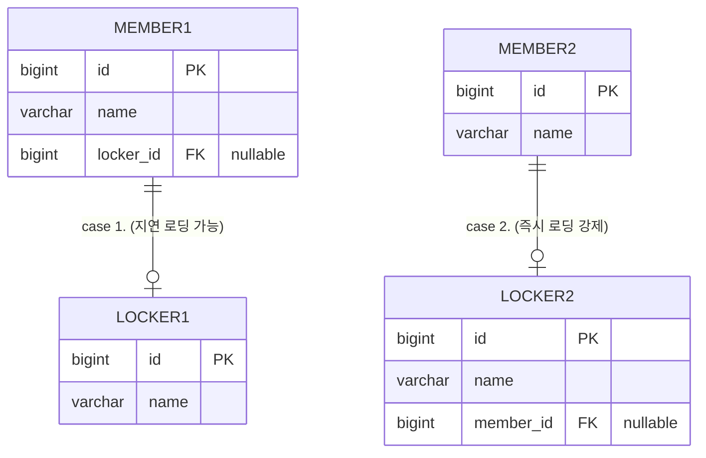

JPA사용 시, 1:1 매핑에 관한 고찰 글이다. 주 테이블과 대상 테이블의 관계에서 주 테이블이 대상의 FK를 가지고 있지 않는 한 프록시 객체 한계로 즉시 로딩이 발생하는건 잘 알려진 사실이다. 이것에 대한 정리 글과 우회하는 방법 그리고 프록시에 대한 내 나름의 정리글을 기록하고자 한다.  

# OnoToOne 과 Lazy
Jpa에서는 1:1 관계가 되면 아래처럼 FK를 누가 가지고 있느냐에 따라 로딩 시점이 결정 된다.

## Case 1. 주 테이블에 대상 테이블의 FK
N+1 문제를 피하기 위해 보통 주 테이블이 대상의 FK를 가지게 (case 1) 코드를 작성하는 경우가 많다.
```kotlin
@Entity  
@Table(name = "member_case1")  
class Member(  
    @Id @GeneratedValue(strategy = GenerationType.IDENTITY)  
    val id: Long? = null,  
  
    @Column(nullable = false)  
    val name: String,  
  
    @OneToOne(fetch = FetchType.LAZY)  
    @JoinColumn(name = "locker_id")  // 주 테이블 Member에 FK    
    val locker: Locker? = null
)
    
@Entity  
@Table(name = "locker_case1")  
class Locker(  
    @Id @GeneratedValue(strategy = GenerationType.IDENTITY)  
    val id: Long? = null,  
  
    @Column(nullable = false)  
    val name: String  
)
```

## Case 2.  대상 테이블에 주 테이블의 FK
대상 테이블이 주 테이블의 FK를 가지게 되는 경우다. 이 경우에는 N+1 문제로 인해 이대로 설정하기에는 실무에서는 꺼림찍하다. 
```kotlin
@Entity  
@Table(name = "member_case2")  
class Member(  
    @Id @GeneratedValue(strategy = GenerationType.IDENTITY)  
    val id: Long? = null,  
  
    @Column(nullable = false)  
    val name: String,  
  
    @OneToOne(mappedBy = "member", fetch = FetchType.LAZY)  
    val locker: Locker? = null  
)

@Entity  
@Table(name = "locker_case2")  
class Locker(  
    @Id @GeneratedValue(strategy = GenerationType.IDENTITY)  
    val id: Long? = null,  
  
    @Column(nullable = false)  
    val name: String,  
  
    @OneToOne  
    @JoinColumn(name = "member_id")  // 대상 테이블 Locker에 FK    
    val member: Member  
)
```

### 우회 전략
아니면 '추후에는 회원이 라커를 2개 이상 가질 수도 있다' 는 조건처럼 미리 예상하고 대상 테이블이 주 테이블의 FK를 가지게 (case 2) 작성하는 경우도 있다. 이럴 경우에는 N+1 문제를 회피하기 위해 두 가지 우회 전략을 취할 수 있다. 이렇게 작성할 경우에는 둘 다 어느 정도 문서화가 필요하다.

1. QueryDsl 전략
Jpa 연관관계 자동 로딩을 아예 사용하지 않고, 필요할 때만 QueryDSL로 명시적으로 조회하는 방식도 있다. 이 방식이 아마 가장 흔하지 않을까싶다. 

2.  OneToMany 관계 + `getter`,  `setter`  커스텀
Set 자체를 private으로 접근을 차단하고 `getter` 는 반드시 1개 호출,  `setter`도 하나만 설정 가능하게 하는 방법도 있다. 이렇게 하면 `_lockers` 는 반드시 id를 가지고 있지 않아도 되기 때문에 N+1을 피할 수 있다.
```kotlin
@Entity  
@Table(name = "member_case3")  
class Member3(  
    @Id @GeneratedValue(strategy = GenerationType.IDENTITY)  
    val id: Long? = null,  
  
    @Column(nullable = false)  
    val name: String,  
  
    @OneToMany(mappedBy = "member", fetch = FetchType.LAZY)  
    private val _lockers: MutableSet<Locker> = mutableSetOf()  
) {  
    // 읽기 전용으로 노출  
    val locker: Locker?  
        get() = _lockers.firstOrNull()  
        
	// 1개만 설정 가능한 setter
	fun setLocker(locker: Locker3?) {  
    // 기존 관계 제거  
    _lockers.clear()  
  
    // 새 관계 설정  
    if (locker != null) {  
        _lockers.add(locker)  
        locker.member = this  // 양방향 설정  
    }  
}
  
}
@Entity  
@Table(name = "locker_case3")  
class Locker3(  
    @Id @GeneratedValue  
    val id: Long? = null,  
  
    val name: String,  
  
    @ManyToOne(fetch = FetchType.LAZY)  
    @JoinColumn(name = "member_id")  
    private var _member: Member3? = null  
)
```

3. OneToMany관계 + 커스텀 Set
이렇게까지 하는 경우는 없겠지만 구현 자체는 가능했기 때문에 기록해둔다.

```kotlin
// 1개만 허용하는 불변 Set
private class SingleItemSet<T> : MutableSet<T> {
    private val delegate = mutableSetOf<T>()
    
    override fun add(element: T): Boolean {
        if (delegate.isNotEmpty()) {
            throw IllegalStateException("SingleItemSet은 1개만 허용합니다. clear() 후 추가하세요.")
        }
        return delegate.add(element)
    }
    
    override fun addAll(elements: Collection<T>): Boolean {
        if (elements.size > 1 || delegate.isNotEmpty()) {
            throw IllegalStateException("SingleItemSet은 1개만 허용합니다")
        }
        return delegate.addAll(elements)
    }
    

    // ...나머지 구현
}

@Entity
class Member(
    @Id @GeneratedValue
    val id: Long? = null,
    
    val name: String,
    
    @OneToMany(mappedBy = "member", fetch = FetchType.LAZY)
    private val _lockers: MutableSet<Locker> = SingleItemSet()
) {
    val locker: Locker?
        get() = _lockers.firstOrNull()
    
    fun setLocker(locker: Locker?) {
        _lockers.clear()
        locker?.let { 
            _lockers.add(it) 
            it.member = this
        }
    }
    
    // 내부에서 실수로 이렇게 하면?
    private fun wrongUsage() {
        _lockers.add(Locker(name = "A"))  // OK
        _lockers.add(Locker(name = "B"))  // 예외 발생
    }
}

```

