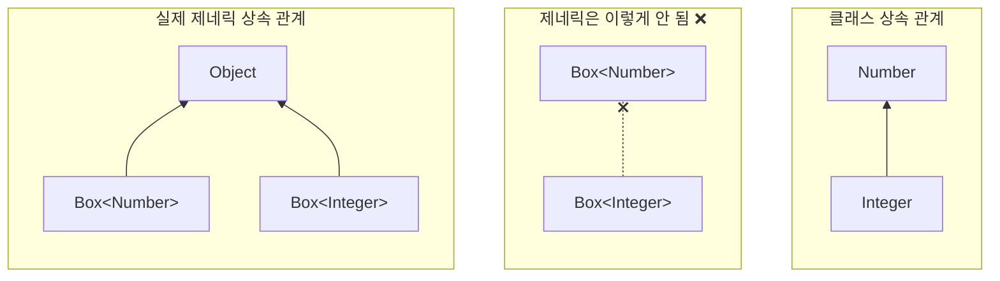

어떤 타입이 다른 타입에 호환된다면 할당이 가능하다.
```java
Object someObject = new Object();
Integer someInteger = new Integer(10);
someObject = someInteger;
```
`Integer`는 `Object`의 하위이기 때문에 할당할 수 있다.
객체지향 용어에서는 이를 **"is a"** 관계라고 부른다. `Interger`는 `Object`의 한 종류 (`Interger` is a kind of `Object`)이기 때문에 할당 가능하다. 또한 `Interger`는 `Number`의 의 한 종류 이기도 하다.

``` java
public void someMethod(Number n) { /* ... */ }

someMethod(new Integer(10)); 
someMethod(new Double(10.1)); 
```

제네릭에서도 동일하다. `Number` 타입을 인자로 넘겨 제네릭 타입을 호출할 때, `add` 메서드는 `Number`에 호환되는 타입들을 인자로 허락한다.
```java
Box<Number> box = new Box<Number>();
box.add(new Integer(10)); 
box.add(new Double(10.1));
```

그렇다면 아래 메서드는 어떨까?
```java
public void boxTest(Box<Number> n) {}
```

`boxTest`는 `Box<Integer>` , `Box<Double>`을 인자로 받을 수 있을까? 정답은 **"No"** 다 왜냐하면, 둘 다 `Box<Number>` 의 하위타입(Sub Type)이 아니기 때문이다. 제네릭을 이해하는데 있어 쉽게 오해할 수 있는 부분이지만, 반드시 학습해야할 중요한 개념이다.



### 제네릭 클래스와 서브타이핑(Generic Classes and Subtyping)
제네릭 클래스나 인터페이스도 `extends`나 `implements`로 상속/구현해서 하위 타입을 만들 수 있다(Sub Typing)
두 제네릭 타입 간의 타입 파라메터 관계는 `extends`나 `implements`에 어떻게 선언했는지에 따라 결정된다.
```java
// List<E>를 implements해서 하위 타입 생성 
public class ArrayList<E> implements List<E> { }
```
`ArrayList<E>`는 `List<E>`의 하위 타입이다. 그리고 `List<E>`의 타입 파라메터 `E`가 그대로 전달된다. 
아래 코드를 보자.
```java
List<Integer> list = new ArrayList<Integer>(); // O - 타입 파라미터 일치
List<Integer> list = new ArrayList<String>(); // X - 타입 파라미터 불일치
```
타입파라메터 `E`에 해당하는 `Interger` 가 그대로 전이 된다. `ArrayList<String>`과 같은 선언은 허용되지 않는다.
정리하자면 아래와 같다.
1. 클래스 상속은 제네릭에서도 유지되지만, 타입 파라메터 간의 상속 관계는 제네릭으로 전이되지 않는다.
2. 즉, 제네릭은 **불변**이다.

**쉽게 말해서 제네릭 타입 간의 상속은 클래스 상속을 유지하지만 타입 파라메터는 상속이 불가능하다.**